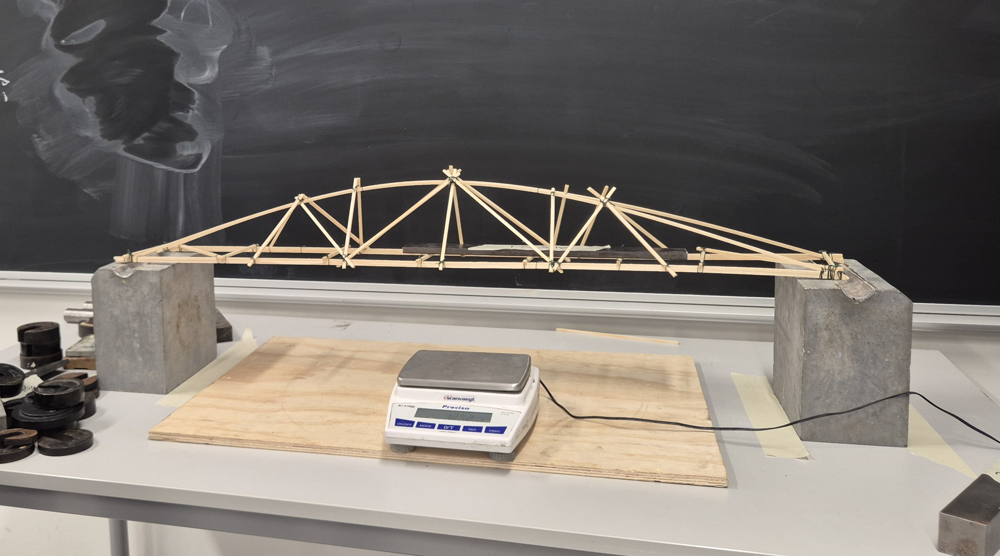
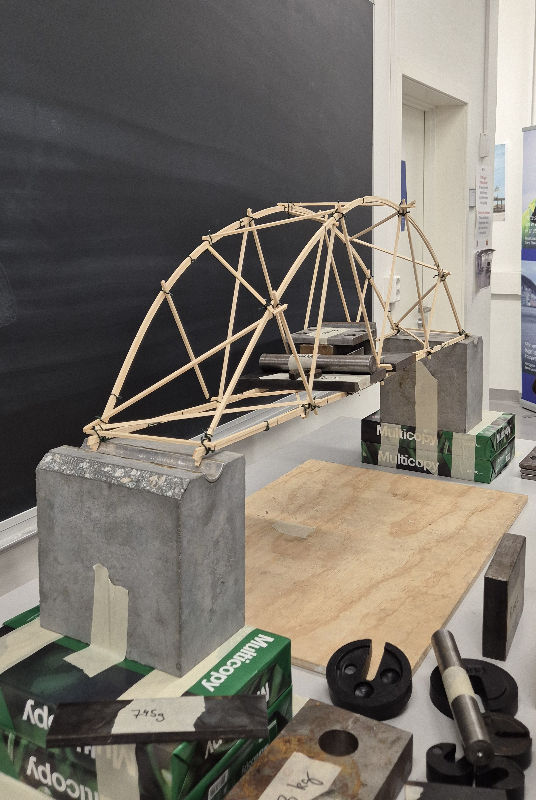
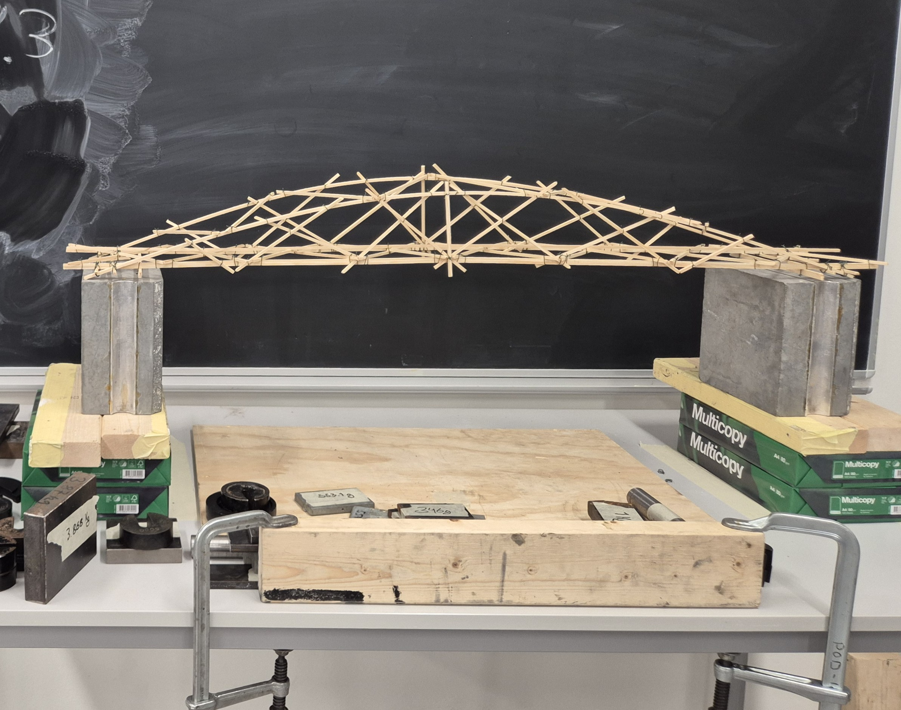

## Om bruprosjektet

Prosjektet går ut på at en skal bygge en brukonstruksjon som har et fritt spenn på minst 90 cm. 

Det er om å gjere å få høgast mulig forhold mellom brua sin bæreevne og egenvekta på brua. Dette tester en ved å belaste brua midt i spennet med små vekter. 

Kvar gruppe består av fire studenter, og kvar gruppe har to og en halv time på å bygge brua. På slutten av økta skal gruppene:

* Vege brua (og fotografere brua mens den er på vekta)
* Sette brua på bruspennet og legge på belastning på brua til den kollapser

Husk å fotografere brua på bruspennet med vekter på, og etter at den har kollapsa, noter vektene som den blei belasta med.

Påmeldingslenke ligger på Canvas.

### Regler

* Det er ikkje lov til å bunte sammen meir enn to og to pinner (med dette meines det å feste dei sammen i lengderetninga).

* Fritt spenn må vere minst 90 cm, dvs bør sjølve brua vere minst 1 meter.

### Utstyr 
- Trepinner med dimensjon 3 mm x 3 mm
- Blomsterbindetråd
- Jernbindertang
- Tommestokk
- Vernebriller

### Tips

Av erfaring er det viktig å bruke en del tid på at blomsterbindertråden er stram og holder godt. Tenk også over symmetrien i brua.

### Eksempel 

{width=80%}

{width=80%}

{width=80%}
